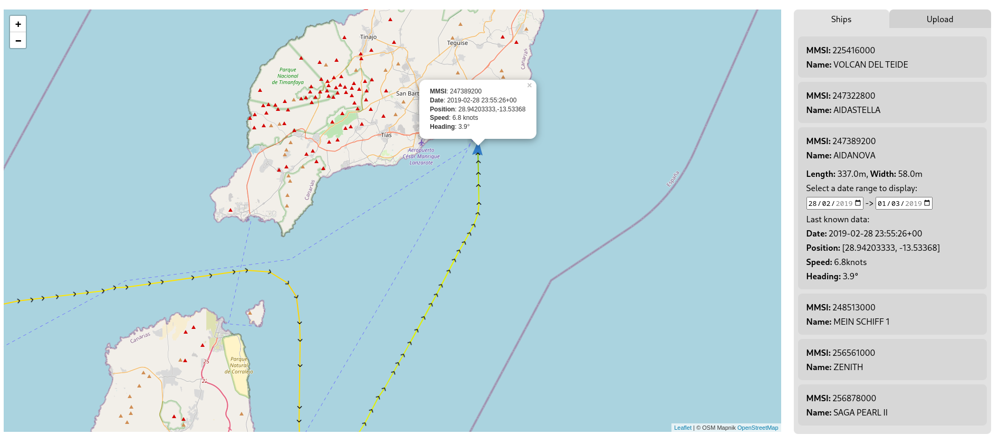
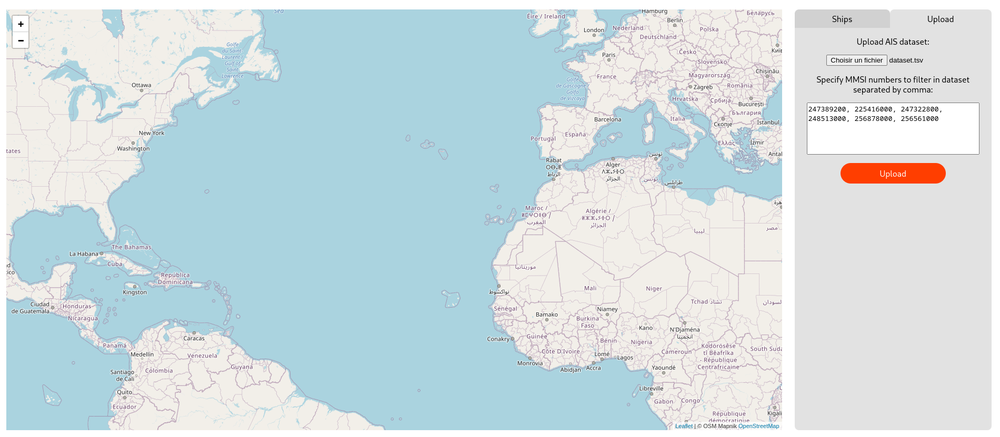
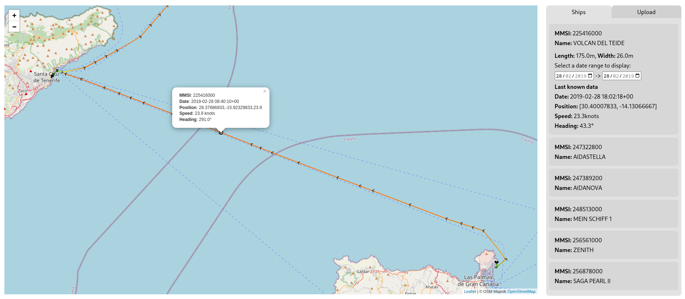

# AIS Data Visualizer

Web tool to import csv AIS dataset and display ships navigation on a map. Using javascript web framework Svelte and Leaflet map library 

  
  
[Demo here](https://nicolas-kermagoret.github.io/data-nav/)  

## Running  

Get Node and npm.  
Download source code from github then open a terminal in the root directory
```
git clone https://github.com/Nicolas-Kermagoret/data-nav.git
cd data-nav
npm install
npm run dev
```
It should run app on your `localhost:3000`

## How it works ?

On the side panel, add a csv/tsv file containing dataset, then specify ships MMSI number you want to display on the map (ex: `247389200, 225416000, 247322800, 248513000, 256878000, 256561000`)  

  
  
Now click on the "Upload" button to process data. If ships found they should be displayed on the map and in the side list. To see their data just click on them on the map or in the list. By default it shows the last day's data, you can select date range using calendars inputs.  
Each record line is displayed as a marker on the map (represented by a ">"), by clicking on it you can display informations about the record.  


  